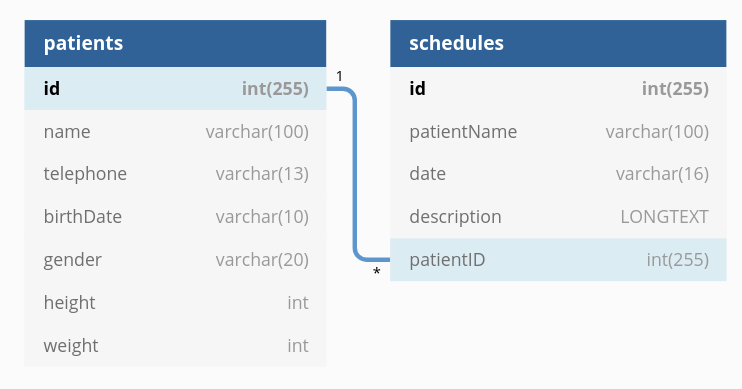

# Desafio PEBMED

## PRONTOMED

Este projeto é uma aplicação full-stack que permite o cadastro, listagem, edição e remoção de pacientes, assim como suas respectivas consultas.

### Tecnologias

* [NodeJS][node] para o desenvolvimento da API
* [Express][express] e [Sequelize][sequelize] para facilitar a construção da API
* [Jest][jest], [React Testing Library][rtl], [Mocha][mocha] e [Chai][chai] para testes unitários
* [React][react] para a construção do front-end.
* [Docker Compose][docker] para a conteinerização de todos os componentes da aplicação.

### Modelagem do banco de dados

O banco de dados proposto possui 2 tabelas: `Patients` e `Schedules`. Um determinado paciente pode ter diversas consultas. Já uma consulta pertence única e exclusivamente a um paciente, conforme figura abaixo.

O modelo de dados pode ser consultado no arquivo `sample.sql` que estána pasta `db`.

### Estrutura de arquivos

#### API

Abaixo uma explicação dos principais arquivos do projeto:

* `server.js`: código de entrada da API
* `src/controllers/*`: controllers para as requisições relacionadas a Pacientes e Consultas
* `src/models/*`: modelos para Pacientes e Consultas
* `src/routes/*`: rotas para Pacientes e Consultas
* `src/config/*`: configuração do banco de dados
* `src/postman/*`: collection para poder testar a API de forma local quando a mesma estiver rodando usando o comando npm run dev

#### Front-end

Abaixo uma explicação dos principais arquivos do projeto:

* `src/index.tsx`: código de entrada da aplicação
* `src/client/*`: cliente que faz as requisições para a API
* `src/components/*`: componentes criados para a aplicação

## Uso

O projeto conta com alguns comandos iniciais definidos na seção `scripts` do
arquivo `package.json` tanto para a API quanto para o Front-end.

### Docker Compose

Para executar a aplicação com o [Docker Compose][docker] é necessário executar os seguintes passos:

* Instalar as dependências tanto da API quanto do Front-end usnado o comando `yarn install`
* Rodar o comando `docker-compose build` para fazer o build da aplicação
* Rodar o comando `docker-compose up -d` para fazer o build da aplicação
* Rodar o comando `docker-compose logs -f -t` para monitorar os logs da aplicação. Esperar o front-end terminar de subir para poder usar a aplicação.

Quando a aplicação estiver rodando, ela pode ser acessada na URL: [http://localhost:3000](http://localhost:3000).

Para parar a execução da aplicação use o comando `docker-compose down`.

### API

* `start`: levanta o server de produção
* `dev`: levanta o server de desenvolvimento
* `test:unit`: roda os testes de unidade para a aplicação
* `lint`: verifica a formatação do código
* `test`: roda os testes de unidade para a aplicação junto da verificação de formatação

Os comandos podem ser usados com `yarn run <comando>`.

Veja mais detalhes a seguir.

#### `start`

Levanta o servidor de produção e a aplicação roda no endereço [http://localhost:3001](http://localhost:3001).

#### `dev`

Levanta o servidor de desenvolvimento e abre o browser
no endereço [http://localhost:3001](http://localhost:3001).

Modificações de código serão refletidas automaticamente.

#### `test`

Roda testes usando [Mocha][mocha] e [Chai][chai].

#### Principais rotas

As principais rotas na aplicação são:

* **/api/v1/patients:** endpoint responsável por tratar as requisições feitas para os Pacientes
* **/api/v1/schedules:** endpoint responsável por tratar as requisições feitas para os Agendamentos
* **/api/v1/docs:** endpoint responsável por gerar a documentação swagger para a API

### Front-end

* `start`: levanta o server da aplicação
* `test`: roda os testes de unidade para a aplicação

Os comandos podem ser usados com `yarn run <comando>`.

Veja mais detalhes a seguir.

#### `start`

Levanta o servidor da aplicação no endereço [http://localhost:3000](http://localhost:3000).

#### `test`

Roda testes usando [Jest][jest] e [React Testing Library][rtl].

## Requisitos

Para que este projeto seja executado corretamente, é necessário ter instalados localmente: [Node][node] com versão 10+, [Yarn][yarn] e [Docker Compose][docker].

[express]: https://expressjs.com/
[jest]: https://jestjs.io/
[rtl]: https://testing-library.com/docs/react-testing-library/intro
[sequelize]: https://sequelize.org/
[node]: https://nodejs.org/en/
[docker]: https://docs.docker.com/compose/
[yarn]: https://yarnpkg.com/
[react]: https://reactjs.org/
[mocha]: https://mochajs.org/
[chai]: https://www.chaijs.com/